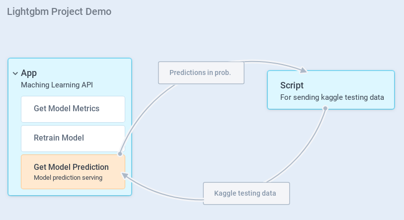
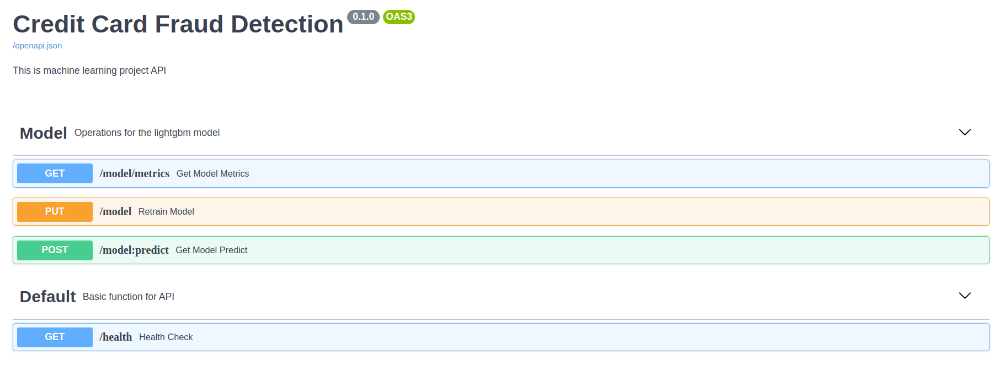
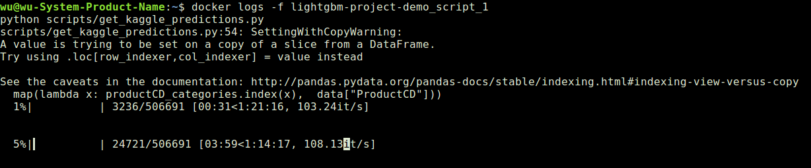
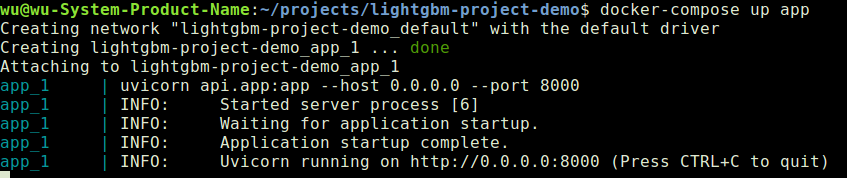

# Credit Card Fraud Detection

For this project, I used the datasets from the  kaggle competition called [IEEE-CIS Fraud Detection](https://www.kaggle.com/c/ieee-fraud-detection/data). The competition aims to improve fraud prevention system by building fraud detection models based on [Vesta Corporation's](https://trustvesta.com/) real-world e-commerce transactional data, which contains information from device type to product features.  My personal goal for this project is to not only explore the data and build models, but to also build an API server with retrainable model.  To achieve this goal, I used **fastapi**, **lightgbm** and **ray tune**. 

Also, I decided to develop this project to be the same as how data-related projects are developed in real-world scenarios, wherein the end goal of development is a project that is feasible for production. Therefore, I have put efforts on creating:

1. Exploratory Data Analysis (EDA) in the `notebooks/` folder;
2. An API Server inside the `api/` folder;
3. Files for deployment such as Dockerfile and docker-compose.yml;
4. Documentations in the `docs/` folder; and
5. Some necessary scripts in `scripts/` folder.

## Services

I have two services: `app` and `script`. 

### App

 The `app` service is a machine learning API that is open on port 8000. I used fastapi for the API server, so you can check it on **http://localhost:8000/docs** after you run the `app` service.

### Scripts

The `script` sends the request for the predictions on new sets of data, such as the kaggle testing data. After the `script` get all the responses, files will be written on **/tmp/submission.csv** (on host and container), but this part can take a lot of time. It is suggested to use **docker logs -f lightgbm-project-demo_script_1** to check the progress of the process.

## How to run this demo

### 1. Install the requirements
- docker
- docker-compose
- make 

### 2. Download the datasets
#### Option 1. 
Setup kaggle API and use 
```
make init-data
```

#### Option 2.
1. Create a data folder: i.e. 
```
mkdir data
```
2. Download the data from kaggle [IEEE-CIS Fraud Detection](https://www.kaggle.com/c/ieee-fraud-detection/data).

3. Put the ieee-fraud-detection.zip inside the `data/` folder.
4. Unzip ieee-fraud-detection.zip.

### 3. Build the image
```
make build
```

### 4. Start the services
Start both the two services
```
docker-compose up
```
or only start the `app` service using
```
docker-compose up app
```


## Here are some documentations
[How to set up the working environment for this project](docs/dev_mode.md)

[API example](docs/api_example.md)


## Note
If you want to change the hyperparameters search space, you can go to `config.py`. Or you even want to use other framework the build the model, I think this demo is detail enough as a reference for your project.

 About the hyperparameter search algorithm, I am using the random search for this demo but if you want to try other searching algorithm, you can change `train.py`.

 I have another project use Tensorflow as the back bone model. Take a look about the project [**lightgbm-project-demo**](https://github.com/raywu60kg/tensorflow-project-demo) 
